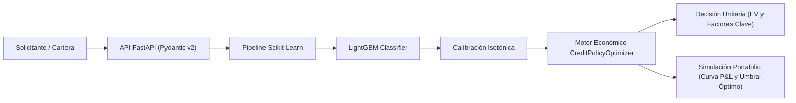

# Credit Policy Optimizer

> Plataforma de alto rendimiento para modelado de riesgo crediticio, calibración de probabilidades de default y optimización económica de políticas de originación en tiempo real.

[](https://github.com/surzua/credit-policy-optimizer/actions/workflows/ci.yml)
[](https://www.python.org/downloads/)
[](https://fastapi.tiangolo.com)
[](https://docs.pydantic.dev/)
[](https://github.com/astral-sh/ruff)
[](https://mypy-lang.org/)

---

## 1. Fundamentos de Negocio y Economía Financiera

Los modelos tradicionales de Machine Learning en banca suelen evaluarse mediante métricas de clasificación estadística como **ROC-AUC**, **F1-Score** o **Accuracy**, empleando puntos de corte ingenuos como $p = 0.5$. En finanzas, este enfoque resulta subóptimo: **el costo de un falso positivo (otorgar un crédito que termina en default) suele ser un orden de magnitud superior al beneficio de un verdadero positivo (el margen financiero generado por un cliente cumplidor)**.

El objetivo de **Credit Policy Optimizer** es alinear directamente la política de decisión con la **función de utilidad financiera** de la institución: maximizar el beneficio económico neto (**P&L**) sujeto a restricciones de riesgo y liquidez.

### 1.1 Matriz de Costo / Beneficio en Originación

| Decisión de Política | Cliente Cumplidor ($Y = 0$) | Cliente en Impago ($Y = 1$) |
| :--- | :--- | :--- |
| **Aprobar Préstamo** | **Aprobado Bueno (True Negative)**<br>• Beneficio: `+Ganancia Neta por Intereses` | **Aprobado Malo (False Positive)**<br>• Pérdida: `-(Pérdida de Capital LGD + Costo de Fondos)` |
| **Rechazar Solicitud** | **Rechazo Erróneo (False Negative)**<br>• Impacto: `-Costo de Oportunidad (Margen Perdido)` | **Rechazo Acertado (True Positive)**<br>• Pérdida Evitada: `$0` |

---

### 1.2 Fórmulas Financieras de Valor Esperado ($EV$)

Para cada solicitud $i$ con monto principal $A_i$, plazo en meses $T_i$, tasa de interés activa nominal $r_i$, costo de fondos institucional $c$, y tasa esperada de pérdida dado el default $\text{LGD}$:

#### 1. Ganancia Neta en Cumplimiento ($\text{Gain}$)
Es el ingreso neto financiero percibido si el acreditado paga puntualmente la totalidad de sus cuotas:

$$
\text{Gain}_i = A_i \times (r_i - c) \times \left(\frac{T_i}{12}\right)
$$

#### 2. Pérdida Neta en Default ($\text{Loss}$)
Es el quebranto financiero del principal no recuperado junto con el costo de fondeo incurrido durante el horizonte del crédito:

$$
\text{Loss}_i = A_i \times \left[\text{LGD} + c \times \left(\frac{T_i}{12}\right)\right]
$$

#### 3. Valor Económico Esperado ($EV$)
Combinando la probabilidad calibrada de default ($PD_i \in [0, 1]$):

$$
EV_i = (1 - PD_i) \times \text{Gain}_i - PD_i \times \text{Loss}_i
$$

Expandiendo por unidad de monto financiado:

$$
EV_i = A_i \left[(1 - PD_i) \cdot (r_i - c)\left(\frac{T_i}{12}\right) - PD_i \cdot \left(\text{LGD} + c\frac{T_i}{12}\right)\right]
$$

#### 4. Umbral Crítico de Indiferencia / Breakeven ($p^*$)
El punto de equilibrio donde el valor esperado es exactamente cero ($EV = 0$):

$$
(1 - p^*) \cdot \text{UnitGain} = p^* \cdot \text{UnitLoss}
$$

$$
p^* = \frac{\text{UnitGain}}{\text{UnitGain} + \text{UnitLoss}} = \frac{(r_i - c)\frac{T_i}{12}}{(r_i - c)\frac{T_i}{12} + \text{LGD} + c\frac{T_i}{12}}
$$

#### 5. Regla Óptima de Decisión

$$
\text{Decision}_i = \begin{cases} 
\text{APROBADO} & \text{si } PD_i \le p^* \iff EV_i > 0 \\ 
\text{RECHAZADO} & \text{si } PD_i > p^* \iff EV_i \le 0 
\end{cases}
$$

---

## 2. Arquitectura de la Solución



- **`data`**: Generador sintético con sesgos crediticios realistas, correlaciones de covarianza y exportación en Polars / Parquet.
- **`models`**: Pipeline reproducible con `DataFrameAligner`, `FeatureEngineer`, `ColumnTransformer` y `LightGBM`. Calibración estricta post-entrenamiento (`CalibratedClassifierCV` con regresión isotónica) para garantizar que las probabilidades representen frecuencias empíricas de impago (minimizando el Brier Score y el ECE).
- **`decision`**: Motor financiero `CreditPolicyOptimizer` que evalúa curvas de concesión, retornos sobre exposición (ROE) y búsqueda del umbral óptimo global.
- **`api`**: Servicio de entrega en producción con `FastAPI` y validación estricta con esquemas `Pydantic v2`.

---

## 3. Guía Técnica de Operación

### 3.1 Requisitos Previos
- **Python 3.11+**
- Gestor de dependencias moderno: [**`uv`**](https://github.com/astral-sh/uv)

```bash
# Instalar uv si no está disponible
curl -LsSf https://astral.sh/uv/install.sh | sh
```

---

### 3.2 Comandos Rápidos con `Makefile`

El proyecto incluye un `Makefile` con los comandos estándar del ciclo de vida de desarrollo:

| Comando | Descripción |
| :--- | :--- |
| `make install` | Instala todas las dependencias del proyecto y de desarrollo mediante `uv sync --all-extras`. |
| `make lint` | Ejecuta análisis estático con `ruff check .` y verificación estricta de tipos con `mypy src`. |
| `make format` | Formatea el código automáticamente con `ruff format` y aplica autofixes con `ruff check --fix`. |
| `make test` | Ejecuta la suite completa de pruebas unitarias e integración con reporte de cobertura (`pytest`). |
| `make data` | Genera o inicializa los datasets sintéticos del portafolio. |
| `make train` | Entrena y calibra el pipeline de riesgo y serializa el artefacto en `models/`. |
| `make run-api` | Inicia el servidor de desarrollo de FastAPI con hot-reload en `http://0.0.0.0:8000`. |
| `make clean` | Elimina archivos temporales de compilación, caché (`.pytest_cache`, `.mypy_cache`, `__pycache__`). |

---

### 3.3 Inicio Rápido en 3 Pasos

```bash
# 1. Instalar dependencias
make install

# 2. Ejecutar pruebas y linters
make lint
make test

# 3. Iniciar el servicio API
make run-api
```

La documentación interactiva OpenAPI (Swagger UI) queda disponible inmediatamente en:
👉 **`http://localhost:8000/docs`**

---

## 4. Catálogo de la API y Ejemplos de Consumo

### 4.1 `GET /health`
Verifica la disponibilidad del servicio y el estado de carga del pipeline calibrado.

```bash
curl -X GET "http://localhost:8000/health"
```

**Respuesta (200 OK):**
```json
{
  "status": "ok",
  "version": "0.1.0",
  "model_loaded": true
}
```

---

### 4.2 `POST /decision`
Evalúa a un solicitante individual, calcula su probabilidad de default calibrada, el valor económico esperado ($EV$), determina si es `APROBADO` o `RECHAZADO` y genera factores explicables de decisión.

```bash
curl -X POST "http://localhost:8000/decision" \
  -H "Content-Type: application/json" \
  -d '{
    "application_id": "APP-2026-0042",
    "monthly_income": 6500.0,
    "debt_to_income": 0.22,
    "historical_delinquencies": 0,
    "revolving_utilization": 0.25,
    "loan_amount": 12000.0,
    "loan_term_months": 24,
    "interest_rate": 0.18,
    "cost_of_funds": 0.05,
    "lgd": 0.45
  }'
```

**Respuesta (200 OK):**
```json
{
  "application_id": "APP-2026-0042",
  "decision": "APROBADO",
  "calibrated_pd": 0.046233,
  "expected_value": 2441.52,
  "breakeven_pd": 0.320988,
  "decision_threshold": 0.320988,
  "net_gain_performing": 3120.0,
  "net_loss_default": 6600.0,
  "key_factors": [
    {
      "name": "Debt to Income (DTI)",
      "value": 0.22,
      "impact": "FAVORABLE",
      "description": "DTI saludable (22.0%), amplia capacidad de servicio de deuda."
    },
    {
      "name": "Historial de Morosidades",
      "value": 0,
      "impact": "FAVORABLE",
      "description": "Sin morosidades históricas de 30+ días registradas."
    },
    {
      "name": "Uso de Líneas Rotativas",
      "value": 0.25,
      "impact": "FAVORABLE",
      "description": "Uso prudente de líneas rotativas (25.0%)."
    },
    {
      "name": "Relación Monto / Ingreso Mensual",
      "value": 1.85,
      "impact": "FAVORABLE",
      "description": "Monto solicitado representa 1.8 meses de ingreso bruto."
    },
    {
      "name": "Spread Financiero Neto",
      "value": 0.13,
      "impact": "FAVORABLE",
      "description": "Spread financiero positivo y atractivo (13.0%)."
    },
    {
      "name": "Valor Esperado (EV)",
      "value": 2441.52,
      "impact": "FAVORABLE",
      "description": "Retorno esperado positivo (+$2,441.52 USD). PD calibrada (4.62%) inferior a breakeven (32.10%)."
    }
  ]
}
```

---

### 4.3 `POST /simulate-portfolio`
Simula el comportamiento de una cohorte completa de solicitudes evaluando múltiples puntos de corte ($p$) para encontrar la política óptima que maximiza el beneficio del portafolio.

```bash
curl -X POST "http://localhost:8000/simulate-portfolio" \
  -H "Content-Type: application/json" \
  -d '{
    "applications": [
      {
        "application_id": "APP-001",
        "monthly_income": 7500.0,
        "debt_to_income": 0.19,
        "historical_delinquencies": 0,
        "revolving_utilization": 0.20,
        "loan_amount": 10000.0,
        "loan_term_months": 12,
        "interest_rate": 0.18,
        "cost_of_funds": 0.05
      },
      {
        "application_id": "APP-002",
        "monthly_income": 1400.0,
        "debt_to_income": 0.70,
        "historical_delinquencies": 3,
        "revolving_utilization": 0.90,
        "loan_amount": 15000.0,
        "loan_term_months": 24,
        "interest_rate": 0.12,
        "cost_of_funds": 0.08
      }
    ],
    "thresholds": [0.05, 0.08, 0.12, 0.20, 0.50]
  }'
```

**Respuesta (200 OK):**
```json
{
  "total_applications": 2,
  "optimal_threshold": 0.08,
  "max_expected_pnl": 1240.50,
  "baseline_05_pnl": 410.20,
  "incremental_pnl_vs_baseline": 830.30,
  "evaluations": [
    {
      "threshold": 0.05,
      "total_applications": 2,
      "approved_count": 1,
      "approval_rate": 0.5,
      "total_exposure": 10000.0,
      "gross_margin": 1300.0,
      "expected_loss": 230.50,
      "expected_pnl": 1069.50,
      "expected_default_rate": 0.046,
      "return_on_exposure": 0.107
    },
    {
      "threshold": 0.08,
      "total_applications": 2,
      "approved_count": 1,
      "approval_rate": 0.5,
      "total_exposure": 10000.0,
      "gross_margin": 1300.0,
      "expected_loss": 230.50,
      "expected_pnl": 1069.50,
      "expected_default_rate": 0.046,
      "return_on_exposure": 0.107
    }
  ]
}
```

---

## 5. Integración Continua (CI/CD)

El repositorio cuenta con un pipeline automatizado en GitHub Actions ([`.github/workflows/ci.yml`](.github/workflows/ci.yml)) que se ejecuta en cada Pull Request y push a la rama `main`:

1. **Ruff Linter**: `uv run ruff check .` para calidad y formato de código según PEP 8.
2. **Mypy Type Checker**: `uv run mypy src` con tipado estricto habilitado (`strict = true`).
3. **Pytest Coverage**: `uv run pytest --cov=src` validando la totalidad de la suite de pruebas unitarias y de integración de la API.
